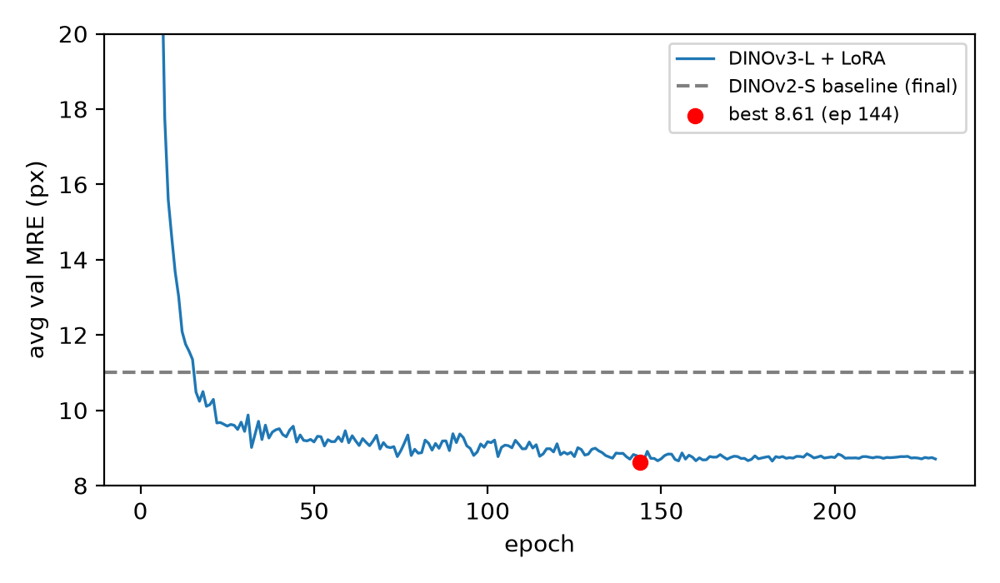

# FoundUS 2026 Team Aston-AIRobotics

**Encoder Capacity Is the Binding Constraint in Unified Multi-Task Ultrasound Landmark Detection**

Accepted at the FoundUS 2026 Challenge & Workshop, MICCAI 2026 (poster presentation, Springer LNCS proceedings). A single LoRA-adapted DINOv3 encoder addresses all nine ultrasound biometry tasks; a controlled ablation identifies encoder capacity, not loss or resolution engineering, as the binding constraint.

## Project resources

* **Paper:** [PDF](paper/foundus_paper.pdf) (accepted, MICCAI 2026 FoundUS Workshop, Springer LNCS). Also on [OpenReview](https://openreview.net/group?id=MICCAI.org/2026/Workshop/MWM). Springer proceedings link to be added once published.
* **Challenge:** [FoundUS 2026](https://mwm2026.github.io/gu-biometry)
* **Poster:** [Poster PDF](poster/FoundUS_Poster_Aston.pdf)
* **Code:** this repository

## Authors & contact

* Saeed Moosivand (lead), Aston University, UK. [240169451@aston.ac.uk](mailto:240169451@aston.ac.uk)
* Ziyang Wang, Aston University, UK. [z.wang47@aston.ac.uk](mailto:z.wang47@aston.ac.uk)

## Overview

The FoundUS 2026 challenge asks for a single unified model that localizes anatomical landmarks across nine heterogeneous ultrasound biometry tasks (A4C, AOP, FA, FUGC, HC, IVC, PLAX, PSAX, fetal femur). We ask a focused question: what limits the accuracy of such a model, the loss design, the output resolution, or the capacity of the shared encoder?

Through a controlled ablation that varies one factor at a time, we show that increasing encoder capacity is the single change that moves the metric: swapping a DINOv2-Small encoder for a DINOv3-Large encoder with LoRA cuts average Mean Radial Error (MRE) from 11.01 to 8.61 px, and on the hardest task (HC) from 30.5 to 19.1 px. Five other interventions (loss variants, foreground weighting, higher output resolution) do not beat the baseline.

## Method

* **Encoder:** DINOv3 ViT-Large (`vit_large_patch16_dinov3.lvd1689m`), frozen, adapted with LoRA (rank 16, alpha 32, dropout 0.05). Only 2.39M of 305M parameters are trained (0.78%).
* **Heads:** one lightweight per-task heatmap head, 128x128 heatmaps (sigma 3.0), decoded to landmark coordinates.
* **Input:** 512x512 (LongestMaxSize + pad, ImageNet normalization).
* **Loss:** MSE on Gaussian landmark heatmaps.
* **Optimizer:** AdamW; encoder LoRA LR 2e-5, heads LR 1e-3; CosineAnnealingLR (eta_min 1e-6); batch 8; up to 250 epochs; seed 42.
* **Augmentation:** affine with independent x/y scaling (0.75-1.30, to synthesise aspect-ratio variation), translation, rotation; photometric (brightness/contrast, gamma, noise, blur, compression).
* **Split-screen detection:** cardiac dual-panel acquisitions are detected and cropped to the active panel, giving large gains (IVC 40.2 to 2.76, PSAX 27.4 to 1.70 px).

## Results (held-out split)

| Encoder | Avg | A4C | AOP | FA | FUGC | HC | IVC | PLAX | PSAX | Femur |
|---|---|---|---|---|---|---|---|---|---|---|
| DINOv2-S (baseline) | 11.01 | 3.74 | 6.24 | 10.25 | 8.77 | 30.48 | 4.93 | 3.26 | 1.78 | 29.60 |
| **DINOv3-L + LoRA** | **8.61** | 3.93 | 6.36 | 8.68 | 6.82 | **19.12** | 2.76 | 3.35 | 1.70 | **24.81** |

Mean Radial Error in pixels (lower is better). Gains concentrate on the hardest tasks (HC, fetal femur).

**Generalization gap:** local held-out 8.61 px vs. challenge server 25.60 px. A controlled distortion test isolates the cause: stretching the aspect ratio alone (1.48 to 1.90) triples the error (10.5 to 35.1 px), so acquisition-geometry covariate shift, not encoder capacity, is the remaining limit.



## Repository structure

```
paper/          accepted paper PDF
poster/         MICCAI 2026 poster PDF
training/       train_finetune.py, model_factory.py, dataset.py, utils.py
inference/      model.py (challenge submission interface)
preprocessing/  detect_splitscreen.py, apply_crop.py
requirements.txt
```

## Requirements

`torch>=2.1, timm>=1.0.20, peft>=0.19, albumentations, opencv-python, pandas, numpy, tqdm`

Install with `pip install -r requirements.txt`.

## Training and inference

Train with `python training/train_finetune.py` (DINOv3 weights loaded from `PRETRAINED_ENCODER_PATH`; epochs configurable via `NUM_EPOCHS`). At inference, `Model.predict()` in `inference/model.py` writes `regression_predictions.json` with normalized and pixel landmark coordinates per task.

## Citation

> Moosivand, S., Wang, Z. Encoder Capacity Is the Binding Constraint in Unified Multi-Task Ultrasound Landmark Detection. MICCAI 2026 FoundUS Workshop.

## Acknowledgements

FoundUS 2026 Challenge, MICCAI 2026. Built on the official challenge baseline, nnU-Net, and DINOv3 self-supervised weights.
